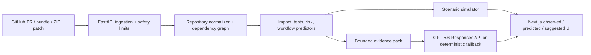

# PR Consequence Simulator

PR Consequence Simulator analyzes a proposed code change and predicts its likely blast radius, relevant tests, engineering risk, workflow delay, and safest next action.

## Live demo

**Production:** https://pr-consequence-simulator.vercel.app — no account required.

**Source:** https://github.com/manasrpandya/PR_consequence_sim

For the fastest judge test, paste a public GitHub PR URL such as `https://github.com/vercel/next.js/pull/82995`, inspect it, then start analysis. A prepared example is available at `/demo`. The hosted app also accepts a Git bundle or project ZIP plus patch, with a **3.5 MB combined multipart limit**. Public URL mode supports public GitHub PRs; no token is sent to the browser.

## Problem

Pull requests alter technical dependencies and team workflows, but impact, test selection, risk, and delivery timing are usually handled by separate tools. Teams need one evidence-backed consequence view before merge.

## Solution and capabilities

The product ingests a change, constructs repository and workflow evidence, predicts impact, ranks tests, estimates transparent risk and supported workflow outcomes, compares next-action scenarios, and explains the conclusion. It supports:

- public GitHub PR analysis;
- small Git bundle analysis;
- small project ZIP plus `.diff`/`.patch` analysis;
- a guided synthetic example with known ground truth;
- evidence, confidence, provenance, deterministic baselines, and optional GPT-5.6 explanations.

## Architecture



Vercel Services deploys `apps/web` (Next.js) and `services/engine` (FastAPI/Python 3.12) as one project. Same-origin `/api/*` and `/health` routes reach FastAPI; other routes reach Next.js. Upload workspaces use request-scoped temporary storage and are removed in the same request. Fixtures are packaged as read-only backend assets.

## Prediction methodology

The current version uses transparent deterministic and statistical baselines: bounded dependency traversal, structural test ranking, additive risk factors, workflow heuristics, and explicit action weights. It does **not** claim a learned latent twin is implemented. The planned research progression is a unified action-conditioned latent model of repository and workflow state.

The current differentiator is: **A unified consequence-analysis pipeline that combines technical impact and workflow implications, then compares evidence-backed next-action scenarios.** Individual test, risk, workflow, or digital-twin techniques are not claimed as unprecedented. GPT-5.6 explains supplied evidence and predictions; it does not invent numerical outputs.

## One-minute judge test

1. Open the production site.
2. Paste a public GitHub pull-request URL and select **Inspect input**.
3. Select **Analyze change**.
4. Inspect Observed, Predicted, and Suggested sections.
5. Expand evidence and provenance.
6. Read the provider-labelled explanation.
7. Compare with `/demo` or analyze a materially different second PR.

## Local setup and tests

Requirements: Node 20+, pnpm 10.33+, Python 3.12, Git, and optionally Vercel CLI 56+.

```bash
git clone https://github.com/manasrpandya/PR_consequence_sim.git
cd PR_consequence_sim
pnpm install --frozen-lockfile
python3.12 -m venv services/engine/.venv
services/engine/.venv/bin/pip install -r services/engine/requirements.txt
cp .env.example apps/web/.env.local
pnpm dev
```

Open `http://localhost:3000`; FastAPI runs on `http://localhost:8000`. Vercel-local execution is `vercel dev -L` when Services is enabled.

```bash
pnpm test
pnpm lint
pnpm typecheck
pnpm --dir apps/web build
pnpm eval
PYTHONPATH=services/engine services/engine/.venv/bin/python -c 'from app.main import app; print(app.title)'
```

## Deployment

`vercel.json` defines the frontend and backend services and same-origin rewrites. Runtime environment names are `GITHUB_TOKEN` (optional), `OPENAI_API_KEY` (optional), `OPENAI_MODEL` (`gpt-5.6-sol` in deployment), `NEXT_PUBLIC_APP_URL` (canonical metadata URL), `NEXT_PUBLIC_ENGINE_URL` (local or split deployments only), and `ALLOWED_ORIGINS` (split deployments only). Secrets stay server-side.

```bash
pnpm dlx vercel@latest build --yes
pnpm dlx vercel@latest deploy --yes
pnpm dlx vercel@latest deploy --prod --yes
curl -fsS https://pr-consequence-simulator.vercel.app/health
```

Vercel request/response payloads are limited to 4.5 MB, so the UI and backend reserve multipart overhead and cap hosted files at 3.5 MB total. Functions are bounded to 60 seconds; GitHub calls use shorter timeouts.

## Supported platforms and limitations

- JavaScript/TypeScript receive enhanced structural import inference; other languages use a labelled generic fallback.
- URL mode supports public GitHub repositories only and inspects at most 300 changed files.
- Hosted uploads are small; submitted code is never executed.
- Test selection is structural when coverage is absent; risk is heuristic, not production-calibrated.
- Workflow estimates may be unavailable without history; scenario estimates are not causal guarantees.
- This is a Builder Week prototype, not a production security or merge-approval product.

## Security and privacy

GitHub analysis reads public PR metadata and changed source text only from allowlisted `api.github.com` endpoints. ZIP paths, symlinks, decompression, file counts, binaries, and likely secret files are filtered. Git operations disable hooks, filters, scripts, dependency installation, and checkout. Uploaded projects are processed temporarily in request-scoped workspaces and cleanup is best-effort. Source is not logged. GPT explanations receive a compact evidence summary—not the full repository—and use `store: false`. No guarantee of confidentiality or threat detection is made.

## Evaluation

`pnpm eval` reproducibly evaluates three synthetic fixtures with known ground truth. The current run reports impact F1 `0.726`, selected-test F1 `0.811`, missed failing-test rate `0.000`, selected/full CI duration `76.8%`, and workflow MAE `30.9 minutes`. These are fixture metrics, not production performance. Live analyses expose diagnostics and confidence but have no ground-truth accuracy claim.

## Built with Codex and GPT-5.6

The project was developed with extensive assistance from ChatGPT GPT-5.6 Sol for research, product reasoning, critical analysis, and orchestration, and Codex with GPT-5.6 for repository implementation, iteration, tests, hardening, and deployment. The human builder selected the problem, transferred goals, reviewed results, tested the product, evaluated trade-offs, redirected changes, and retained final submission decisions. AI contribution was substantial and remained human-reviewed.

| Phase | ChatGPT GPT-5.6 Sol | Codex with GPT-5.6 | Human role |
| --- | --- | --- | --- |
| Research and thesis | Analyzed usability, precedent, novelty, and competition fit | Inspected implementation boundaries | Selected direction and constrained claims |
| Architecture and engine | Critiqued evidence, confidence, and honesty requirements | Implemented schemas, predictors, simulator, API, and fixtures | Reviewed outputs and requested corrections |
| UX and inputs | Diagnosed fixture-first weaknesses and defined judge flow | Implemented onboarding, live PRs, uploads, provenance, and navigation | Tested clarity and limitations |
| OpenAI runtime | Defined evidence-grounded explanation boundaries | Implemented Responses API provider, `store: false`, IDs, timeout, and fallback | Supplies credentials and verifies behavior |
| Production | Defined serverless and Vercel acceptance criteria | Added Services routing, safety limits, tests, builds, deployment, and smoke checks | Approved release and submission |

Chronology: research/product selection → fixture vertical slice (`fixtures`, predictors) → onboarding (`apps/web`) → public GitHub ingestion → secure user uploads → production hardening → Vercel deployment. See [the detailed AI build log](docs/ai-build-log.md).

## Codex acceleration and key decisions

Codex accelerated scaffolding, typed schemas, FastAPI endpoints, fixture generation, dependency traversal, test ranking, risk factors, workflow baselines, action simulation, frontend components, onboarding, GitHub APIs, upload safety, provenance UI, tests, debugging, Vercel configuration, and documentation. Decisions favored a public PR URL as the primary no-login path, deterministic baselines before a learned model, evidence and uncertainty first, GPT explanation without numeric invention, no uploaded-code execution, a retained ground-truth fixture, and a small honest hosted limit.

## Future work

Train and calibrate an action-conditioned latent repo/workflow model on consented historical data, integrate coverage and CI history, and evaluate predictions prospectively.

## License

No license has been added because the repository owner’s preferred legal copyright name has not been confirmed. Add the approved license before submission; do not assume that public visibility alone grants reuse rights.
